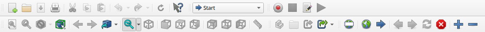
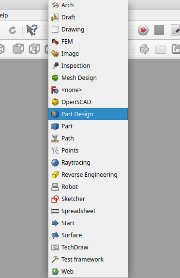
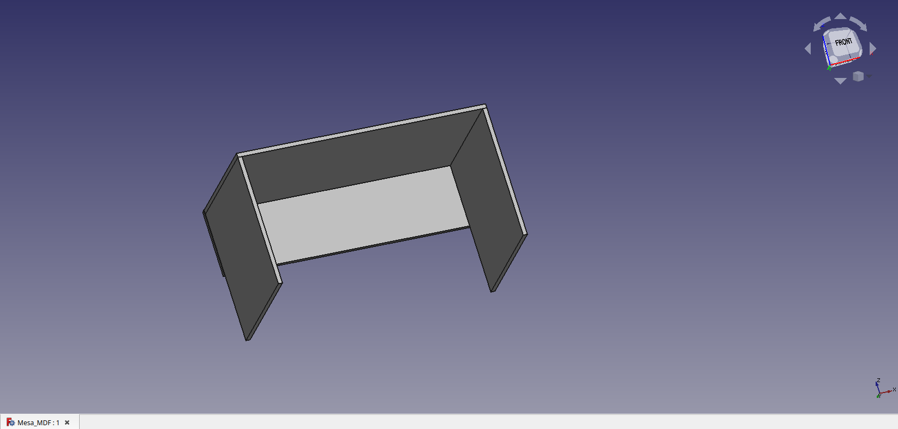
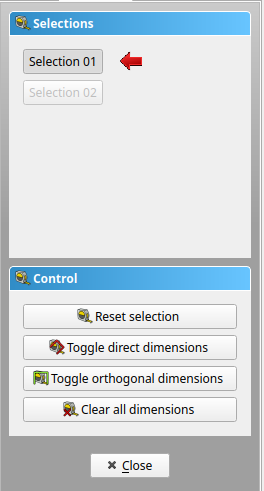
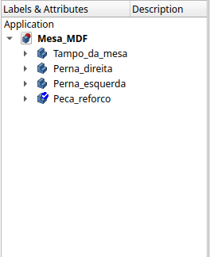

### **1. Instalação e Configuração do FreeCAD**

#### **Introdução**

O primeiro passo para começar sua jornada no FreeCAD é garantir que o software esteja instalado corretamente no seu computador e configurado para atender às suas necessidades. Este guia detalhado o ajudará a realizar a instalação no seu sistema operacional e a ajustar as preferências iniciais para um uso mais eficiente.

---

#### **1.1. Download do FreeCAD**

1. Acesse o site oficial do FreeCAD: [https://www.freecadweb.org/](https://www.freecadweb.org/).
2. Clique na aba **Download**.
3. Escolha a versão correspondente ao seu sistema operacional:
   - **Windows**
   - **macOS**
   - **Linux**

---

#### **1.2. Instalação no Windows**

1. Após baixar o arquivo executável (`.exe`), clique duas vezes para iniciar o instalador.
2. Siga as etapas do assistente de instalação:
   - Aceite os termos de licença.
   - Escolha o diretório de instalação (ou mantenha o padrão).
   - Selecione os componentes adicionais, como atalhos na área de trabalho.
3. Clique em **Instalar** e aguarde a conclusão.
4. Após a instalação, abra o FreeCAD para confirmar que foi instalado corretamente.

---

#### **1.3. Instalação no macOS**

1. Baixe o arquivo `.dmg` do site oficial.
2. Clique duas vezes no arquivo baixado e arraste o ícone do FreeCAD para a pasta **Aplicativos**.
3. Abra o FreeCAD clicando no ícone na pasta **Aplicativos**.
   - Nota: Se uma mensagem de segurança for exibida, acesse **Preferências do Sistema > Segurança e Privacidade** e clique em "Abrir Mesmo Assim".
4. O FreeCAD estará pronto para uso.

---

#### **1.4. Instalação no Linux**

O FreeCAD está disponível para a maioria das distribuições Linux e pode ser instalado via gerenciadores de pacotes. Aqui estão os comandos para as distribuições mais populares:

- **Ubuntu/Debian:**
  ```bash
  sudo apt update
  sudo apt install freecad
  ```

- **Arch Linux:**
  ```bash
  sudo pacman -S freecad
  ```

- **Fedora:**
  ```bash
  sudo dnf install freecad
  ```

Se preferir, você também pode baixar a versão AppImage diretamente do site oficial. Basta torná-la executável e iniciar o programa:

```bash
chmod +x FreeCAD.AppImage
./FreeCAD.AppImage
```

---

#### **1.5. Configurações Iniciais**

Depois de instalar o FreeCAD, você pode personalizá-lo para atender às suas preferências. Aqui estão algumas configurações recomendadas:

1. **Idioma:**
   - Abra o FreeCAD e vá em **Edit > Preferences > General > Language**.
   - Escolha seu idioma preferido e reinicie o FreeCAD para aplicar a mudança.

2. **Sistema de Unidades:**
   - Vá em **Edit > Preferences > General > Units**.
   - Escolha o sistema de unidades (ex.: milímetros ou polegadas) de acordo com suas necessidades.

3. **Tema e Aparência:**
   - Em **Edit > Preferences > General > Style**, escolha um tema que facilite a visualização.
   - Considere o tema "Dark" para longas sessões de trabalho ou o padrão "Light" para maior contraste.

---

#### **1.6. Testando a Instalação**

1. Abra o FreeCAD e explore a tela inicial.
2. Crie um novo documento clicando em **File > New**.
3. Verifique se as principais workbenches (Sketcher, Part Design) estão disponíveis no menu suspenso de workbenches.<br>
<br>

---


### **2. Familiarização com a Interface do FreeCAD**

#### **Introdução**

Agora que o FreeCAD está instalado e configurado, é hora de conhecer a interface do programa. Familiarizar-se com os elementos principais da tela é essencial para navegar no software e acessar rapidamente as ferramentas que você precisará para criar seus projetos.

---

#### **2.1. Estrutura Básica da Interface**

Ao abrir o FreeCAD, você verá uma interface organizada em diferentes áreas, cada uma com funções específicas. Vamos detalhar os principais elementos:

1. **Barra de Menus (Topo):**
   - Contém opções clássicas, como **File**, **Edit**, **View**, **Tools**, entre outras.
   - É o ponto de partida para operações gerais, como criar novos arquivos, salvar projetos e acessar preferências.<br><br>
   <br><br>

2. **Barra de Ferramentas (Abaixo do Menu):**
   - Apresenta atalhos para ações frequentes, como abrir, salvar e desfazer.
   - Muda de acordo com o **workbench** selecionado (falaremos disso a seguir).
   <br><br>
   <br><br>

3. **Workbenches (Caixa no Topo Esquerdo):**
   - O FreeCAD é organizado em **workbenches** (bancadas de trabalho), cada uma com ferramentas específicas para tarefas como modelagem 3D, criação de esboços ou geração de desenhos técnicos.
   - A lista suspensa de workbenches permite alternar entre diferentes ambientes de trabalho.<br><br>
   <br><br>

4. **Área de Visualização (Centro):**
   - É o espaço onde você verá e interagirá com seus modelos.
   - Oferece uma visão tridimensional que pode ser manipulada com o mouse.
   <br><br>
   <br><br>


5. **Painel de Tarefas (Lado Direito):**
   - Aparece quando você inicia ferramentas ou operações específicas.
   - Exibe informações contextuais e opções para a tarefa selecionada.
<br><br>
   <br><br>

6. **Árvore do Modelo (Lado Esquerdo):**
   - Mostra uma hierarquia de todos os elementos do seu projeto.
   - É onde você pode selecionar, ocultar ou editar objetos individuais.
<br><br>
   <br><br>


7. **Painel de Propriedades (Abaixo da Árvore do Modelo):**
   - Exibe as propriedades detalhadas do objeto selecionado, como dimensões, material ou posição.

   **ilustração**

---

#### **2.2. Personalizando a Interface**

O FreeCAD permite que você ajuste a interface para atender ao seu fluxo de trabalho:

1. **Mostrar/Ocultar Painéis:**
   - Clique com o botão direito na barra de ferramentas ou vá em **View > Panels** para exibir ou ocultar painéis, como a Árvore do Modelo ou o Painel de Propriedades.

2. **Movendo Painéis:**
   - Arraste painéis para reposicioná-los na tela ou destacá-los como janelas flutuantes.

3. **Atalhos Personalizados:**
   - Vá em **Tools > Customize > Keyboard** para configurar atalhos de teclado para ações frequentes.

---

#### **2.3. Explorando os Workbenches**

Workbenches são uma característica fundamental do FreeCAD, oferecendo ferramentas específicas para diferentes tarefas. Aqui estão os principais para começar:

- **Sketcher:** Usado para criar esboços 2D, base para modelagem 3D.
- **Part Design:** Permite criar sólidos a partir de esboços e realizar operações como extrusão e corte.
- **TechDraw:** Ferramentas para gerar desenhos técnicos.
- **Draft:** Para criar objetos 2D mais complexos, como plantas ou esquemas.

**Atividade Prática:**
- Acesse o menu de **workbenches** no topo esquerdo e selecione o **Sketcher**.
- Observe como a barra de ferramentas muda para exibir ferramentas relacionadas ao ambiente de esboço.

---

#### **2.4. Navegando na Área de Visualização**

A área de visualização 3D é onde você verá e manipulará os modelos. Use as seguintes interações com o mouse para navegar:

1. **Rotacionar:**
   - Clique e segure o botão do meio do mouse e mova para girar o modelo.

2. **Mover:**
   - Clique com o botão direito do mouse e arraste para mover a visão.

3. **Zoom:**
   - Role a roda do mouse para aproximar ou afastar.

**Atividade Prática:**
- Crie um cubo simples usando a workbench **Part**.
- Pratique a rotação, movimentação e zoom para explorar o modelo.

---

#### **2.5. Testando a Interface**

1. Abra um novo documento em **File > New**.
2. Navegue pela interface para localizar as ferramentas mencionadas.
3. Alterne entre diferentes workbenches e observe como a barra de ferramentas muda.

---

