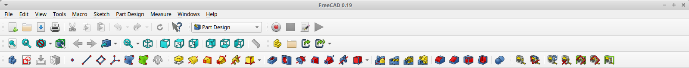

### **Instalação e Configuração do FreeCAD**

#### **Introdução**

O primeiro passo para começar sua jornada no FreeCAD é garantir que o software esteja instalado corretamente no seu computador e configurado para atender às suas necessidades. Este guia detalhado o ajudará a realizar a instalação no seu sistema operacional e a ajustar as preferências iniciais para um uso mais eficiente.

---

#### **1. Download do FreeCAD**

1. Acesse o site oficial do FreeCAD: [https://www.freecadweb.org/](https://www.freecadweb.org/).
2. Clique na aba **Download**.
3. Escolha a versão correspondente ao seu sistema operacional:
   - **Windows**
   - **macOS**
   - **Linux**

---

#### **2. Instalação no Windows**

1. Após baixar o arquivo executável (`.exe`), clique duas vezes para iniciar o instalador.
2. Siga as etapas do assistente de instalação:
   - Aceite os termos de licença.
   - Escolha o diretório de instalação (ou mantenha o padrão).
   - Selecione os componentes adicionais, como atalhos na área de trabalho.
3. Clique em **Instalar** e aguarde a conclusão.
4. Após a instalação, abra o FreeCAD para confirmar que foi instalado corretamente.

---

#### **3. Instalação no macOS**

1. Baixe o arquivo `.dmg` do site oficial.
2. Clique duas vezes no arquivo baixado e arraste o ícone do FreeCAD para a pasta **Aplicativos**.
3. Abra o FreeCAD clicando no ícone na pasta **Aplicativos**.
   - Nota: Se uma mensagem de segurança for exibida, acesse **Preferências do Sistema > Segurança e Privacidade** e clique em "Abrir Mesmo Assim".
4. O FreeCAD estará pronto para uso.

---

#### **4. Instalação no Linux**

O FreeCAD está disponível para a maioria das distribuições Linux e pode ser instalado via gerenciadores de pacotes. Aqui estão os comandos para as distribuições mais populares:

- **Ubuntu/Debian:**
  ```bash
  sudo apt update
  sudo apt install freecad
  ```

- **Arch Linux:**
  ```bash
  sudo pacman -S freecad
  ```

- **Fedora:**
  ```bash
  sudo dnf install freecad
  ```

Se preferir, você também pode baixar a versão AppImage diretamente do site oficial. Basta torná-la executável e iniciar o programa:

```bash
chmod +x FreeCAD.AppImage
./FreeCAD.AppImage
```

---

#### **5. Configurações Iniciais**

Depois de instalar o FreeCAD, você pode personalizá-lo para atender às suas preferências. Aqui estão algumas configurações recomendadas:

1. **Idioma:**
   - Abra o FreeCAD e vá em **Edit > Preferences > General > Language**.
   - Escolha seu idioma preferido e reinicie o FreeCAD para aplicar a mudança.

2. **Sistema de Unidades:**
   - Vá em **Edit > Preferences > General > Units**.
   - Escolha o sistema de unidades (ex.: milímetros ou polegadas) de acordo com suas necessidades.

3. **Tema e Aparência:**
   - Em **Edit > Preferences > General > Style**, escolha um tema que facilite a visualização.
   - Considere o tema "Dark" para longas sessões de trabalho ou o padrão "Light" para maior contraste.

---

#### **6. Testando a Instalação**

1. Abra o FreeCAD e explore a tela inicial.
2. Crie um novo documento clicando em **File > New**.
3. Verifique se as principais workbenches (Sketcher, Part Design) estão disponíveis no menu suspenso de workbenches.<br>
<br>

---

